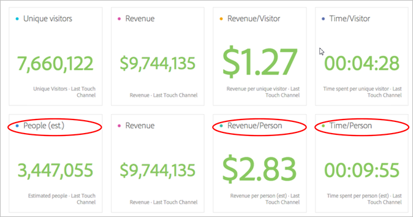

# 人员指标{#people-metric}

“人员”指标是基于Adobe设备图的人员（或设备组）计数。 您可以应用“人员”量度来在访客工作区中跨设备识别分析。

## 人员指标先决条件和注意事项 {#section-34551d0435fb4b3cb3fad736b7961541}

<table id="table_120F7EF50042485391E58B22DD00A2A8"> 
 <thead> 
  <tr> 
   <th colname="col1" class="entry"> 先决条件或考虑事项 </th> 
   <th colname="col2" class="entry"> 描述 </th> 
  </tr>
 </thead>
 <tbody> 
  <tr> 
   <td colname="col1"> 
设备协作 
 </td> 
   <td colname="col2"> 
 要使用“人员”指标，请成为Adobe <a href="http://landing.adobe.com/en/na/events/summit/275658-summit-co-op.html" format="html" scope="external"> Experience Cloud Device Co-op的成员</a>。 该合作社可标识个人的多个设备（或Experience Cloud ID）。 Analytics利用此信息从统计角度推断与品牌互动的人数。 该指标精确到5%以内。 
 
<b>地区</b>: 设备合作社目前仅在美国和加拿大提供。 因此，在评估“人员”指标时，您应将区段应用于分析，以仅过滤器您的美国和加拿大数据。 
 
每周，设备图表都会计算合作社的新版本，并发布供使用。 周二，系统会收集最新数据并发布图形的更新版本。 然后，Experience Cloud解决方案使用最新版图。 对于Analytics，更改将在周三读取，处理更改通常需要1到2个工作日。 
 
 
重要：  当图表每周更新时，它会影响过去的人员指标。 换言之，历史人数统计随着时间的推移而发生变化，因为图表会学习和更新。 例如，如果您今天运行的报表上个月对人员进行计数，然后在图形更新后的一周内运行同一报表，则历史人员计数可能会略有变化。 
 
 </td> 
  </tr> 
  <tr> 
   <td colname="col1"> 度量权限 </td> 
   <td colname="col2"> 
只有在您被授予了对“人员”度量的访问权限时，才可使用“人员”度量。 管理员可以<a href="https://docs.adobe.com/content/help/en/analytics/admin/user-product-management/customize-report-access/groups-metrics.html" format="html" scope="external"> 在“管理工具</a> ”中自定义指标权限。 
 </td> 
  </tr> 
  <tr> 
   <td colname="col1"> 映射到IMS组织 </td> 
   <td colname="col2"> 
将为映射到IMSORG的所有报表包启 <a href="https://docs.adobe.com/content/help/zh-Hans/core-services/interface/about-core-services/report-suite-mapping.html" format="html" scope="external"> 用人员度量</a>。 
 </td> 
  </tr> 
  <tr> 
   <td colname="col1"> 
分析项目／工具 
 </td> 
   <td colname="col2"> 
在分析工作区  、临时分析、Report Builder  ，以及通过API使用人员量度。 您可以随时随地使用唯一访客量度，包括计算量度。 
 
例如，创建一个按人计收的指标来替换按唯一访客的收入。 
 
可 <a href="https://docs.adobe.com/content/help/zh-Hans/analytics/analyze/analysis-workspace/build-workspace-project/starter-projects.html" format="html" scope="external"> 以使用“人员</a> ”项目模板开始在分析工作区中使用“人员”量度。 
 </td> 
  </tr> 
  <tr> 
   <td colname="col1"> 
打开机器人规则 
 </td> 
   <td colname="col2"> 
Adobe建议您打开机器 <a href="https://docs.adobe.com/content/help/en/analytics/admin/admin-tools/bot-removal/bot-rules.html" format="html" scope="external"> 人规则</a>，尤其是在使用“人员”度量时。 
 
当机器人爬网时，它会人为增加您的“唯一”访客数。 从报表包中删除两个流量可以更准确地衡量数字财产的活动，无论是“唯一访客”还是“人员”。 
 
要执行此操作，请导航到  Analytics &gt;  Admin &gt;  Report Suite。 Select the correct report suite, and then go to  Edit Settings &gt;  General &gt;  Bot Rules. 
 </td> 
  </tr> 
  <tr> 
   <td colname="col1"> 
细分注意事项 
 </td> 
   <td colname="col2"> 
 在将细分与人员指标结合使用时，指标报告可能显着低于预期。 
 
请参 <a href="../other-solutions/people.md#section-d03525420dbe48379fd95b230ef05885" format="dita" scope="local"> 阅将人员指标用于区段</a>。 
 </td> 
  </tr> 
 </tbody> 
</table>

## 人员指标是什么？ {#section-89e2b8f5e80f480391449fc8d1117a6a}

“人员”量度是一种Analytics报告量度，可帮助您将设备归因到人员。 它提供基于人员的营销视图，让您可以衡量访客在所有设备上的活动。 将它想象为一个消除重复的唯一访客版本，您可以将“人员”指标用于以前使用唯一访客的分析。

**设备是人**

在人员指标可用之前，某人（例如）可能会访问您的网站，在三种不同设备上与活动或品牌互动并进行购买，甚至在几分钟内即可完成。 根据您的实施，Analytics可能会将每台设备报告为唯一访客，并将$10归因到$30购买中的三台设备。

人员量度允许您将30美元的购买准确归因为一人：

**提高报表的准确性**

“人员”量度使您能够将多个设备视为一个实体。 以下分析工作区项目显示了独特访客报告和人员报告之间更高的准确性：

并排比较人员和独特访客:

**定义**

<table id="table_F8171AF15DA64607B427E3739EF004D6"> 
 <thead> 
  <tr> 
   <th colname="col1" class="entry"> 项目 </th> 
   <th colname="col2" class="entry"> 描述 </th> 
  </tr>
 </thead>
 <tbody> 
  <tr> 
   <td colname="col1"> 
人员 
 </td> 
   <td colname="col2"> 
“人员”指标基于消费者使用多种设备与您的品牌互动的理念。 您对数据进行的分割或细分越多，同一个人使用该数据分割中的多个设备的可能性就越小。 
 </td> 
  </tr> 
  <tr> 
   <td colname="col1"> 
独特访客 
 </td> 
   <td colname="col2"> 
例如，按日期或时间划分访客的次数越多，“人员”和“唯一”数据之间的差异就越小。 如果您想要更好地了解设备合作社的总体影响，Adobe建议使用最近90天的日期范围 
 </td> 
  </tr> 
  <tr> 
   <td colname="col1"> 
压缩 
 </td> 
   <td colname="col2"> 
使用简单的计算量度，您可以看到“人员”量度占“唯一”访客的百分比的小得多。 单击上表中“压缩”旁的“信息”图标，查看如何创建此度量。 
 
人们可以用在其他计算的指标中，代替“唯一”访客。 
 </td> 
  </tr> 
 </tbody> 
</table>

## 如何计算人员指标？ {#section-0dfb762867e14a7f927796ef3c50592b}

<!--

Analytics uses the HyperLogLog statistical algorithm to calculate People. This means that the smaller the data set, the margin for error may increase. No more than 5% of the numbers should be off by more than 5% 

-->

下图显示了如何计算人员度量，以及如何在过去相同的报告日期范围内随时间减少人员度量。

在此示例中，假定有一组固定的访客。 如果为过去的固定时间范围运行报告，它将显示一组固定访客。 如果设备图表输出第1周左图上显示的数据，则结果为90人。 一周后，在下一次运行设备图表后，将考虑新信息。 如果你运行与一周前相同的报告，人数已经减少到84人。 历史记录已更改，因为设备图提供了有关哪些设备应组合在一起的新信息。

## 将人员指标与细分结合使用 {#section-d03525420dbe48379fd95b230ef05885}

将细分与人员指标结合使用时，指标结果可能显着低于预期。 出现此问题的原因是，在分段中没有 *`person`* 容器。 分段使用访客容器，该容器是定义中的最高级别，基于设备，而不是个人。

此问题主要在使用人员量度堆叠区段时发生。

堆叠区段会创建一个表示区段组合的新区段。 无论您何时：

* 在分析工作区中，将区段放在另一个区段的顶部。 (这些组件会使用运算符自 *`And`* 动连接。)
* 应用包含运算符的单个 *`And`* 段。
* 在项目级别和表级别应用区段。
* 将虚拟报告套件与另一个区段一起使用。

例如，假定您将以下区段堆放在“人员”量度上：

* `Campaign = Spring Promotion`
* `Site Section = Product Overview`

只计算符合这两个细分的人数 *`using a single device`* 。 （“人员”指标不显示不同设备上符合资格的人员数量。）

此外，在此情 *`Or`* 况下不建议使用运算符。 这样做会产生一个数量，一个数量看到一个或另一个数量的人，而且无法计算两个细分的人数。

有关详 [细信息](https://docs.adobe.com/content/help/zh-Hans/analytics/components/segmentation/segmentation-workflow/seg-build.html) ，请参阅分段帮助中的构建区段。

## 设备类型 {#section-8ab378c84ff34574b9c20fecb3848a86}

当您的报表包包含来自多个设备类型的数据时，设备合作社和人员指标在Adobe Analytics中的作用最佳。 例如，将Web和应用程序数据合并到同一报告套件中，可使“人员”指标更强大、更有效。 数据中的设备交叉越多，将多个唯一访客组合为一个人的可能性就越大。

## Experience Cloud ID Service Coverage {#section-bbf0098cac2e467289e7a644a1dea05c}

设备合作计划要求您的数字属性必须使用Experience Cloud ID(MCID)服务进行检测。 如果报表包中的访客包含大量没有MCID的数据，则设备合作社和人员指标的有效性会降低。

<!--
mcdc-people-metric-apply.xml
-->

在分析工作区中，创 [建一个](https://docs.adobe.com/content/help/en/analytics/analyze/analysis-workspace/build-workspace-project/t-freeform-project.html)项目，然后将度量 **[!UICONTROL People]** 拖动到项目表中：

