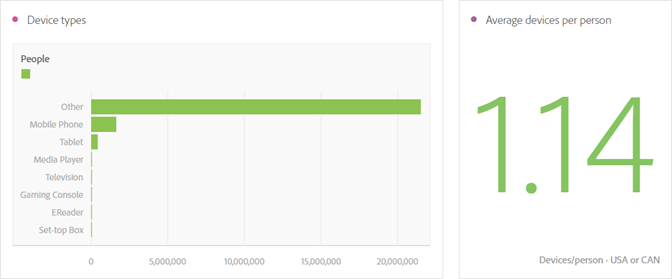

# 人员量度{#people-metric}

人员量度是根据 Adobe 设备图表计算的人数（或设备群组）。您可以应用人员量度，以便在 Analysis Workspace 中识别跨设备访客。

## People Metric Prerequisites and Considerations {#section-34551d0435fb4b3cb3fad736b7961541}

<table id="table_120F7EF50042485391E58B22DD00A2A8"> 
 <thead> 
  <tr> 
   <th colname="col1" class="entry"> 入门项目或考虑项目 </th> 
   <th colname="col2" class="entry"> 描述 </th> 
  </tr>
 </thead>
 <tbody> 
  <tr> 
   <td colname="col1"> 
设备协作 
 </td> 
   <td colname="col2"> 
 To use the People metric, become a member of the <a href="http://landing.adobe.com/en/na/events/summit/275658-summit-co-op.html" format="html" scope="external"> Adobe Experience Cloud Device Co-op</a>. 该合作伙伴可标识个人的多个设备（或Experience Cloud ID）。 Analytics 使用此信息根据统计得出与品牌交互的人员数量。该指标准确到5%以内。 
 
<b>地区：</b>设备协作当前仅在美国和加拿大可用。因此，在评估人员量度时，您应当将区段应用于仅过滤美国或加拿大相关数据的分析。 
 
设备图表每周都会计算新版协作并发布以供使用。每周二，系统会收集最新数据并发布更新版本的图表。然后，Experience Cloud解决方案会使用最新版图形。 对于Analytics，更改将在周三读取，处理这些更改通常需要1到2个工作日。 
 
 
重要说明： 当图表每周更新时，它可能会影响过去的“人员”指标。 换句话说，随着图形学习和更新，历史人员计数可能会随时间而变化。 例如，如果您今天运行的报表上个月计算了人员，然后在图表更新后的一周内运行同一报表，则历史“人员”计数可能会略有变化。 
 
 </td> 
  </tr> 
  <tr> 
   <td colname="col1"> 度量权限 </td> 
   <td colname="col2"> 
只有在您被授予了对“人员”量度的访问权限后，才可以使用“人员”量度。 管理员可以<a href="https://marketing.adobe.com/resources/help/en_US/reference/groups-metrics.html" format="html" scope="external"> 在“管理工具</a> ”中自定义指标权限。 
 </td> 
  </tr> 
  <tr> 
   <td colname="col1"> 映射到IMS组织 </td> 
   <td colname="col2"> 
将为映射到IMSORG的所有报表包启 <a href="https://marketing.adobe.com/resources/help/en_US/mcloud/map-report-suite.html" format="html" scope="external"> 用人员量度</a>。 
 </td> 
  </tr> 
  <tr> 
   <td colname="col1"> 
分析项目/工具 
 </td> 
   <td colname="col2"> 
在 Analysis Workspace、临时分析、报表生成器中和通过 API 使用人员量度。您可以在使用“独特访客”量度（包括“计算量度”）的任何情况下使用此量度。 
 
例如，创建“每个人员的收入”量度来替换“每个独特访客的收入”量度。 
 
可以通过<a href="https://marketing.adobe.com/resources/help/en_US/analytics/analysis-workspace/starter_projects.html" format="html" scope="external">人员项目模板</a>在 Analysis Workspace 中快速使用人员量度。 
 </td> 
  </tr> 
  <tr> 
   <td colname="col1"> 
开启机器人规则 
 </td> 
   <td colname="col2"> 
Adobe 建议您开启<a href="https://marketing.adobe.com/resources/help/en_US/reference/bot_rules.html" format="html" scope="external">机器人规则</a>，尤其当您使用人员量度时。 
 
在机器人爬取您的网站时，它会人为地增加您的独特访客计数。从您的报表包中删除机器人流量有助于在独特访客和人员两个方面，更加精确地测量数字资产的相关活动。 
 
为此，请导航至 Analytics &gt; 管理员 &gt; 报表包。选择正确的报表包，然后转到编辑设置 &gt; 常规 &gt; 机器人规则。 
 </td> 
  </tr> 
  <tr> 
   <td colname="col1"> 
分段注意事项 
 </td> 
   <td colname="col2"> 
 当您使用带人员量度的区段时，量度报表可能比预期的少很多。 
 
请参阅<a href="../other-solutions/people.md#section-d03525420dbe48379fd95b230ef05885" format="dita" scope="local">将人物量度与区段结合使用</a>。 
 </td> 
  </tr> 
 </tbody> 
</table>

## 什么是人员量度？{#section-89e2b8f5e80f480391449fc8d1117a6a}

人员量度是一个 Analytics 报表量度，可帮助您将设备与人员相对应。该量度可提供基于人员的营销视图，允许您跨访客的所有设备衡量访客的活动。您可以将其视为独特访客的去重版本，而且您可以将人员量度用于以前使用“独特访客”的分析。

**设备即人员**

在人员量度可用之前，某人（例如）可能会在三个不同设备上访问您的网站和参与营销活动或品牌活动，并进行购买，甚至在几分钟之内就完成这些操作。根据您的实施，Analytics 可能会将每个设备都报告为独特访客，每个设备贡献 $10，三个设备共贡献 $30。

利用人员量度，您可以准确判断这 $30 购买金额来自于一个人：

**提高报表的准确性**

人员量度让您将多个设备视为一个实体。以下 Analysis Workspace 项目显示了“独特访客”报表和“人员”报表之间的准确性对比：

并排比较“人员”和“独特访客”：

**定义**

<table id="table_F8171AF15DA64607B427E3739EF004D6"> 
 <thead> 
  <tr> 
   <th colname="col1" class="entry"> 项目 </th> 
   <th colname="col2" class="entry"> 描述 </th> 
  </tr>
 </thead>
 <tbody> 
  <tr> 
   <td colname="col1"> 
人员 
 </td> 
   <td colname="col2"> 
人员量度的理念基础是，消费者使用多个设备与您的品牌进行交互。您对数据进行的切片或分段越多，则在该数据切片中由同一个人使用多个设备的机会就越小。 
 </td> 
  </tr> 
  <tr> 
   <td colname="col1"> 
独特访客 
 </td> 
   <td colname="col2"> 
例如，您按日期或时间对数据进行的切片越多，则人员和独特访客之间的区别就越小。如果您希望了解设备合作计划的总体影响，Adobe建议使用最近90天的日期范围 
 </td> 
  </tr> 
  <tr> 
   <td colname="col1"> 
压缩 
 </td> 
   <td colname="col2"> 
使用单个计算量度后，您可以看到人员量度在独特访客中所占的百分比非常小。单击上表中“压缩”旁的信息图标，可查看如何创建此量度。 
 
在其他计算量度中，“人员”可以替代“独特访客”。 
 </td> 
  </tr> 
 </tbody> 
</table>

## 如何计算人员量度？ {#section-0dfb762867e14a7f927796ef3c50592b}

<!--

Analytics uses the HyperLogLog statistical algorithm to calculate People. This means that the smaller the data set, the margin for error may increase. No more than 5% of the numbers should be off by more than 5% 

-->

以下图像显示了如何计算人员量度，以及人员量度在过去同一个报表日期范围内的减少情况。

在此示例中，假设有一组固定访客，如果您在过去的固定时间段运行报表，则会显示一组固定访客。如果设备图表输出第 1 周左侧图表显示的数据，则结果为 90 人。一周后，再次运行设备图表并将新信息考虑进来。如果您运行的是一周前运行的同一个报表，则人数会减少到 84 人。历史记录发生了更改，这是因为设备图表提供了有关哪些设备应该被分为一组的新信息。

## 将人物量度与区段结合使用 {#section-d03525420dbe48379fd95b230ef05885}

在将区域与人员量度结合使用时，量度结果可能比预计少很多。出现此问题是因为在分段中没有 *`person`* container. 分段使用“访客”容器，该容器在定义中级别最高，而且基于设备，而不是人员。

此问题主要发生在区段与人员量度发生堆叠时。

堆叠区段会创建一个新区段来表示该区段组合。当您进行以下操作时，会发生区段堆叠：

* 在 Analysis Workspace 中将一个区段放到另一个区段的顶部。（这些区段会使用&#x200B;*`And`*&#x200B;运算符自动连接。）
* Apply a single segment that contains the *`And`* operator.
* 同时在项目和表格级别应用区段。
* 使用包含其他区段的虚拟报表包。

例如，假设您将以下区段堆叠到人员量度：

* `Campaign = Spring Promotion`
* `Site Section = Product Overview`

Only the number of people who qualify in both segments *`using a single device`* are counted. （人员量度不会显示跨设备符合条件的人数。）

此外，不建议在此情况下使用&#x200B;*`Or`*&#x200B;运算符。如果使用“逻辑或”运算符，会产生满足一个区段或另一个区段的人数，而无法统计同时满足两个区段的人数。

有关更多信息，请参阅分段帮助中的[生成区段](https://marketing.adobe.com/resources/help/en_US/analytics/segment/seg_build.html)。

## 设备类型 {#section-8ab378c84ff34574b9c20fecb3848a86}

当您的报表包包含来自多种设备类型的数据时，设备协作和人员量度在 Adobe Analytics 中的效果最佳。例如，将 Web 和应用程序数据合并到同一个报表包中，可以使人员量度更加强大有效。您数据中的设备交叉性越强，多个独特客户被分组为一个人的机会越大。

## Experience Cloud ID Service Coverage {#section-bbf0098cac2e467289e7a644a1dea05c}

设备协作要求使用Experience Cloud ID(MCID)服务来检测您的数字属性。 如果报表包中的数据包含大量没有 MCID 的访客，则设备协作和人员量度的效率将会大打折扣。

<!--
mcdc-people-metric-apply.xml
-->

In Analysis Workspace, create a [project](https://marketing.adobe.com/resources/help/en_US/analytics/analysis-workspace/t_freeform_project.html), then drag the **[!UICONTROL People]** metric to the project table:

